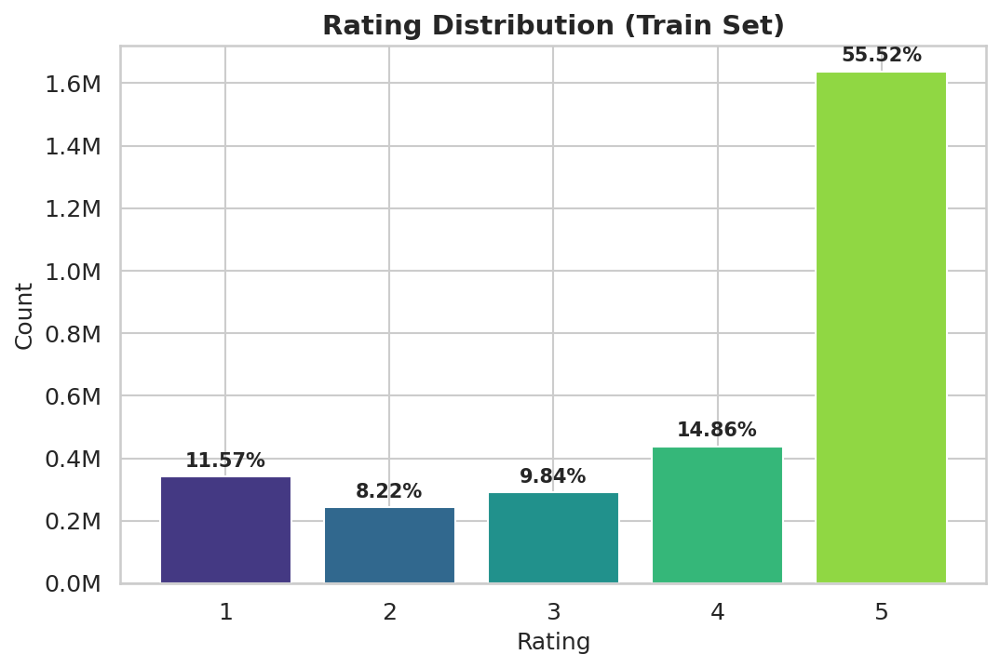
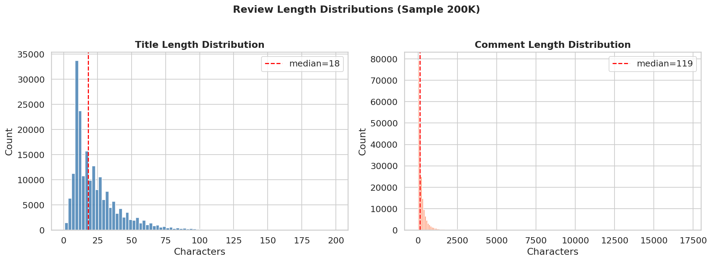
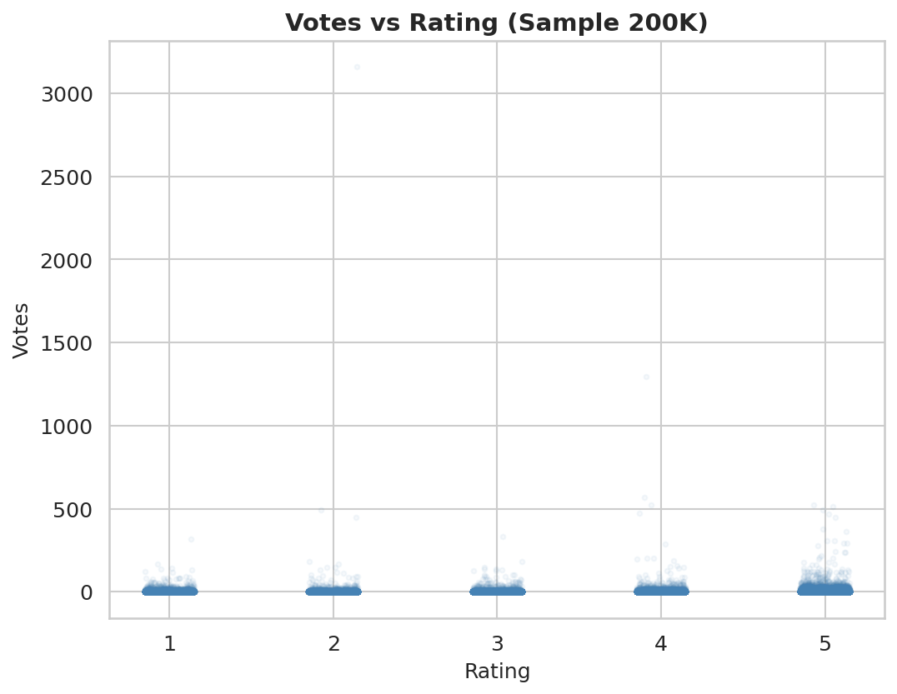
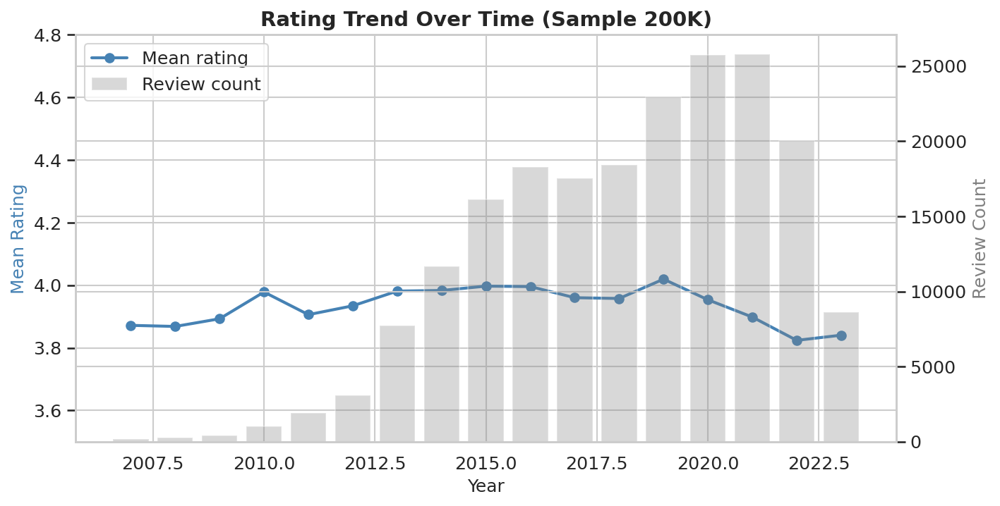
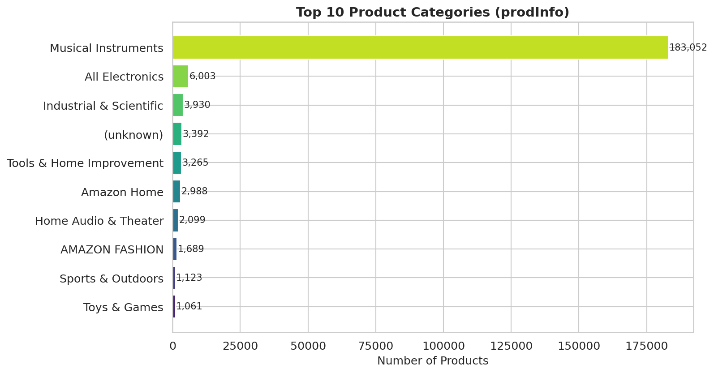
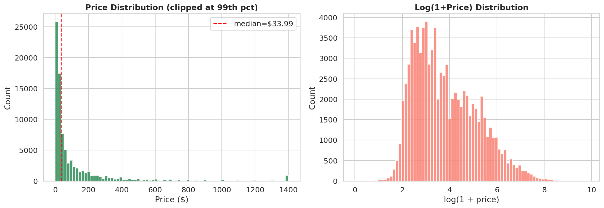

# EDA Report — COMP5434 Review Rating Prediction

**Date**: 2026-06-05

Generated: 2026-06-05 14:47:29

## 1. Dataset Sizes

| Dataset    | Rows        |
|------------|-------------|
| train.csv  |    2,949,249 |
| test.csv   |       10,000 |
| prodInfo.csv |      213,593 |

## 2. Schema

**train.csv**: id, user_id, prod_id, parent_prod_id, title, comment, time, votes, purchased, rating

**test.csv**: id, user_id, prod_id, parent_prod_id, title, comment, time, votes, purchased

**prodInfo.csv**: id, parent_prod_id, main_category, price, title, features, store, rating_number

## 3. Missing Rate (%)

### train.csv
| column         |   missing_% |
|:---------------|------------:|
| id             |         0   |
| user_id        |         0   |
| prod_id        |         0   |
| parent_prod_id |         0   |
| title          |         0   |
| comment        |         0.1 |
| time           |         0   |
| votes          |         0   |
| purchased      |         0   |
| rating         |         0   |

### test.csv
| column         |   missing_% |
|:---------------|------------:|
| id             |        0    |
| user_id        |        0    |
| prod_id        |        0    |
| parent_prod_id |        0    |
| title          |        0    |
| comment        |        0.06 |
| time           |        0.01 |
| votes          |        1.79 |
| purchased      |        0    |

### prodInfo.csv
| column         |   missing_% |
|:---------------|------------:|
| id             |        0    |
| parent_prod_id |        0    |
| main_category  |        1.59 |
| price          |       60.24 |
| title          |        0.01 |
| features       |        0    |
| store          |        1.61 |
| rating_number  |        0.03 |

## 4. Rating Distribution

| Rating | Count      | Pct (%) |
|--------|------------|---------|
| 1 |    341,228 | 11.57 |
| 2 |    242,311 | 8.22 |
| 3 |    290,240 | 9.84 |
| 4 |    438,166 | 14.86 |
| 5 |  1,637,304 | 55.52 |

## 5. Review Length Statistics

| Metric | Title Length | Comment Length |
|--------|-------------|----------------|
| mean   | 23.4 | 220.5 |
| median | 18.0 | 119.0 |
| std    | 17.5 | 343.6 |
| min    | 1 | 0 |
| max    | 199 | 17143 |

## 6. Unique Counts & Overlap

| Metric | Value |
|--------|-------|
| Unique train user_id | 1,744,623 |
| Unique test user_id  | 9,763 |
| Unique train prod_id | 256,957 |
| Unique test prod_id  | 7,885 |
| Unique train parent_prod_id | 211,151 |
| Unique prodInfo parent_prod_id | 213,593 |
| User overlap (train ∩ test) | 9,715 / 9,763 = 99.51% |
| Product overlap (train ∩ test) | 7,877 / 7,885 = 99.90% |
| Cold-start users (test \ train) | 48 / 9,763 = 0.49% |

## 7. Time Range

| Metric | Value |
|--------|-------|
| Earliest | 1970-01-01 08:00:00 |
| Latest   | 2023-09-13 03:25:04 |

## 8. Votes Distribution

| Metric | Value |
|--------|-------|
| mean   | 1.04 |
| median | 0 |
| std    | 9.24 |
| min    | -1 |
| max    | 4650 |
| zeros  | 2,145,250 |

## 9. Purchased Distribution

| Purchased | Count      | Pct (%) |
|-----------|------------|---------|
| True |  2,727,953 | 92.50 |
| False |    221,295 | 7.50 |
| 4 |          1 | 0.00 |

## 10. Rating Over Time

## 11. Top Product Categories (prodInfo)

## 12. Price Distribution

| Metric | Value |
|--------|-------|
| Products with price | 84,878 / 84,916 |
| mean   | $127.71 |
| median | $33.99 |
| std    | $314.53 |
| min    | $0.00 |
| max    | $18990.00 |

## 13. Key Findings

1. **Severe class imbalance**: Rating 5 dominates (~56%), ratings 1-2 are minority classes.
2. **Cold-start problem**: 0.5% of test users never appear in training data.
3. **User overlap**: Only 99.5% of test users are in training — limited user-level features.
4. **Product overlap**: 99.9% of test products appear in training — product-level features are viable.
5. **Reviews are short**: Median title ~18 chars, median comment ~119 chars.
6. **Most reviews have 0 votes**: Median votes=0, highly skewed.
7. **Purchased dominates**: ~N/A% of reviews are from verified purchases.
8. **Price data sparse**: Only 84,878 / 84,916 products have price info.
9. **Data timespan**: Reviews span 1970 to 2023.
10. **Rating_number**: Products have on average 76 prior ratings (median=8).
