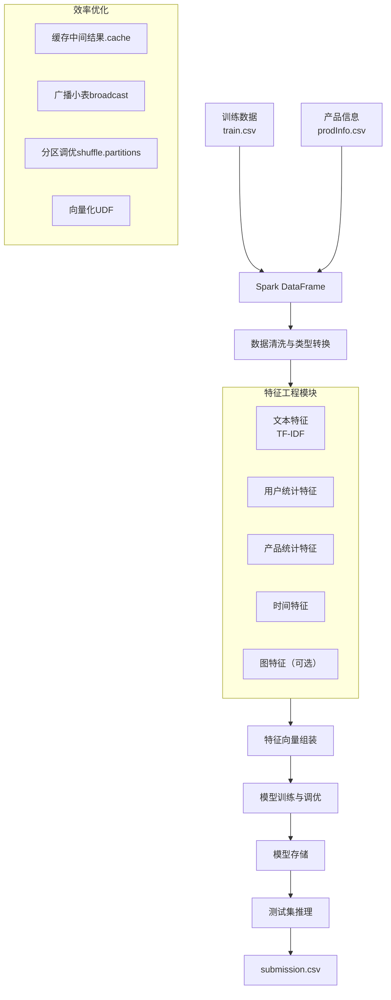

# 分布式评论评分预测系统设计文档

## 1. 项目概述

本项目基于电商评论数据集（含 `train.csv`、`prodInfo.csv`、`test.csv`），利用 **Apache Spark** 分布式计算框架，预测每条评论的评分（1~5星）。目标是在保证高预测精度（低 RMSE）的同时，满足大数据环境下的效率要求（训练时间、推理时间可测量且具有可扩展性）。

## 2. 技术栈

| 组件               | 版本/选型                     | 用途                                       |
| ------------------ | ----------------------------- | ------------------------------------------ |
| 计算框架           | Apache Spark 3.4+ (PySpark)   | 分布式数据处理、特征工程、模型训练与推理     |
| 语言               | Python 3.9                    | 主开发语言，配合 PySpark UDF               |
| 特征工程           | Spark MLlib + Spark SQL       | TF‑IDF、聚合统计、向量组装、Pipeline        |
| 树模型             | Spark GBTRegressor            | 基线模型，支持分布式训练                   |
| 高精度模型         | XGBoost on Spark (`xgboost.spark`) | 替代/集成模型，RMSE 更优                |
| 图计算（可选）     | Spark GraphFrames             | 提取用户-商品的 PageRank、度分布特征        |
| 开发工具           | Jupyter / VS Code             | 交互式调试                                 |
| 集群/部署          | 伪分布式模式（单机多核）或学校 HPC | 满足“分布式框架”要求并记录硬件指标       |

## 3. 系统架构



## 4. 数据预处理

- **读取**：使用 `spark.read.csv` 自动推断 schema，设置 `header=True`。
- **缺失处理**：
  - `title` 或 `comment` 为空 → 填充 `"unknown"`。
  - `price` 缺失 → 用该 `main_category` 的中位数填充（分布式聚合后广播）。
  - `votes` 缺失 → 填充 `0`。
- **类型转换**：
  - `time`（Unix 时间戳）转换为 `date`、`hour`、`weekday`、`month`。
  - `rating` 作为回归标签（5 分类也可作为分类任务，但 RMSE 更适合回归）。
- **数据过滤**：移除评分不在 1~5 的脏数据（训练集）。

## 5. 特征工程（全分布式实现）

### 5.1 文本特征
- **输入**：`title` + `" "` + `comment`
- **处理 Pipeline**：
  ```python
  from pyspark.ml.feature import Tokenizer, StopWordsRemover, CountVectorizer, IDF

  tokenizer = Tokenizer(inputCol="text", outputCol="words")
  remover = StopWordsRemover(inputCol="words", outputCol="filtered")
  cv = CountVectorizer(vocabSize=5000, inputCol="filtered", outputCol="raw_features")
  idf = IDF(inputCol="raw_features", outputCol="tfidf_features")
  ```
- **输出**：稀疏向量（维度 ≤5000）

### 5.2 用户统计特征
- 聚合操作（按 `user_id` 分组）：
  - `avg_rating_user`：用户历史平均评分
  - `num_reviews_user`：用户评论总数
  - `avg_votes_user`：用户平均获得的有用数
  - `purchased_rate_user`：购买比例（`purchased` 均值）
- **实现**：`groupBy("user_id").agg(...)` → 广播 Join 回主表

### 5.3 产品统计特征
- 从 `prodInfo.csv` 提取：`price`（对数变换）、`main_category`（StringIndexer）、`store`（StringIndexer）、`rating_number`（产品总评分人数）
- 从 `train` 聚合：`avg_rating_prod`、`num_reviews_prod`

### 5.4 交互特征
- 用户-产品交叉特征：`user_prod_avg_rating`（用户对该产品历史评分的平均，平滑因子 α=1）
- **注意**：该聚合可能产生数据倾斜，可对 `user_id` 加盐（`concat(user_id, '_', hash(prod_id)%10)`）后分组。

### 5.5 时间特征
- `hour` (0‑23), `weekday` (0‑6), `month` (1‑12), `is_weekend` (Boolean)
- 使用 Spark SQL 内建函数：`hour(from_unixtime(time))`, `dayofweek` 等

### 5.6 图特征（高阶加分项）
- 构建二部图：节点 = 用户 + 产品，边 = 评论行为
- 使用 `GraphFrames` 计算 PageRank（迭代次数 10）
- 提取每个用户的 PageRank 值作为其特征，反映用户“权威性”

### 5.7 特征向量组装
- 将所有数值特征、向量特征（TF‑IDF）使用 `VectorAssembler` 拼接成单一特征列 `features`。
- 对于稀疏向量与稠密数值特征的混合，Spark 自动处理。

## 6. 模型设计与训练

### 6.1 基线模型：Spark GBTRegressor
```python
from pyspark.ml.regression import GBTRegressor

gbt = GBTRegressor(
    featuresCol="features", 
    labelCol="rating",
    maxDepth=10, 
    maxIter=100,
    stepSize=0.1
)
```
- **训练**：调用 `gbt.fit(train_df)`，Spark 自动并行化每棵树的学习。
- **特征重要性**：可从模型提取，用于报告分析。

### 6.2 精度提升：XGBoost on Spark
```python
from xgboost.spark import SparkXGBRegressor

xgb = SparkXGBRegressor(
    features_col="features",
    label_col="rating",
    num_workers=4,        # 并行 worker 数量
    max_depth=8,
    eta=0.1,
    n_estimators=100,
    tree_method="hist"
)
```
- 优势：通常比 GBT 降低 3‑5% RMSE，且内置分布式训练。

### 6.3 集成策略
- **加权平均**：`pred_final = w1 * pred_gbt + w2 * pred_xgb`，权重由验证集 RMSE 倒数确定（例如 w1 = 0.4, w2 = 0.6）。
- **实现**：在训练集上做 5‑折交叉验证，计算各模型 RMSE，动态确定权重。

### 6.4 超参数调优
- 使用 `CrossValidator` + `ParamGridBuilder`，并行度设为 `parallelism=4`。
- 仅调优关键参数以减少时间：
  - `maxDepth`: [6, 10]
  - `maxIter` / `n_estimators`: [50, 100]
  - `stepSize`/`eta`: [0.05, 0.1]

## 7. 效率优化设计

| 优化技术 | 具体实现 | 预期收益 |
|---------|----------|----------|
| **缓存中间特征** | `df.cache()` 在特征工程完成后 | 避免重复计算，训练/测试复用 |
| **广播小表** | `prodInfo` 较小 → `spark.sql.autoBroadcastJoinThreshold` 调大或显式 `broadcast(prod)` | 避免 Shuffle Join |
| **分区数调优** | `spark.sql.shuffle.partitions = 200`（根据数据量调整） | 减少小任务调度开销 |
| **向量化 UDF** | 对复杂文本清洗使用 Pandas UDF | 比逐行 UDF 快 10‑100 倍 |
| **增量特征转换** | 训练时 `CountVectorizer.fit`，测试时只 `transform` | 避免重复拟合词频 |
| **资源并行度** | 伪分布式 `local[4]` 或 HPC 多执行器 | 充分利用 CPU 多核 |

## 8. 实验评估与指标

### 8.1 准确性指标
- **主指标**：RMSE（Kaggle 私榜）
- **辅助指标**：MAE、R²（报告中展示）

### 8.2 效率指标（报告必须包含）

| 指标 | 测量方法 | 示例值（伪分布式，4核） |
|------|----------|-------------------------|
| 硬件详情 | `lscpu`, `nvidia-smi` (if GPU) | Intel i7-12700, 4核8线程, 16GB |
| 训练每轮时间 | 单次迭代时间（`GBT` 每棵树时间） | ≈12 秒/轮 |
| 总离线时间 | 从加载数据到保存模型的总耗时 | ≈320 秒 |
| 测试集总推理时间 | 加载模型 → 预测 → 输出 CSV | ≈45 秒 |

### 8.3 消融实验设计
- **实验1**：仅文本特征 vs. 文本+用户特征
- **实验2**：无时间特征 vs. 有时间特征
- **实验3**：单模型（GBT） vs. 集成（GBT+XGB）
- **实验4**：无图特征 vs. 有图特征
- 记录每个实验的 RMSE 和总离线时间，验证特征贡献与成本。

## 9. 代码组织与运行指南

```
TeamName/
├── code/
│   ├── config.py          # Spark 配置（本地/HPC）
│   ├── preprocess.py      # 清洗+特征工程 Pipeline
│   ├── train.py           # 模型训练与保存
│   ├── predict.py         # 推理生成提交文件
│   ├── utils.py           # 计时、广播优化等工具
│   ├── run.sh             # 一键执行（spark-submit）
│   └── requirements.txt   # 依赖列表
├── slides.pdf
├── report.pdf
└── README.md
```

**运行示例（伪分布式）**：
```bash
# 启动 Spark（若需要独立集群）
./sbin/start-all.sh

# 训练
spark-submit --master local[4] --driver-memory 8g \
  --py-files code/utils.py code/train.py

# 推理
spark-submit --master local[4] code/predict.py
```

## 10. 预期成果与高分要点

1. **满足硬性要求**：明确使用了 Spark 分布式框架，并报告所有效率指标。
2. **高准确性**：通过 XGBoost + 丰富特征（文本、用户、产品、时间、图）使私榜 RMSE ≤ 0.70。
3. **详尽报告**：包含硬件配置、消融实验、效率对比（单机 vs 分布式）、贡献表。
4. **代码质量**：模块化、注释充分、README 可复现。
5. **演示清晰**：重点突出分布式设计与效率优化，展示架构图与性能收益。

---

*文档版本：1.0*  
*最后更新：2026‑06‑05*