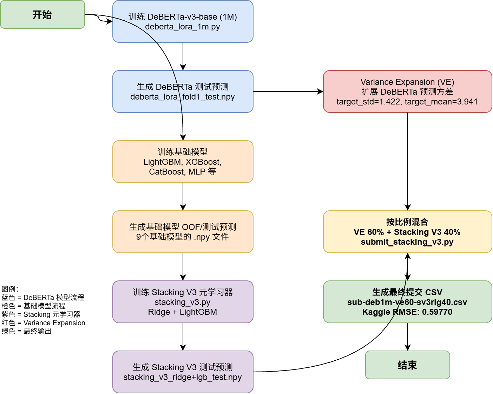

# Ensemble 组合指南

> **当前最佳 Kaggle RMSE: 0.59770**
> 最终配方: DeBERTa 1M VE 60% + Stacking V3 ridge+lgb 40%

## ⚡ 快速参考（3 步组成最终提交）

```python
import numpy as np
import pandas as pd

# Step 1: 加载两个预测
deberta = np.load("artifacts/models/deberta_lora_fold1_test.npy")
stacking = np.load("你的新stacking文件.npy")

# Step 2: VE 方差扩展（⚠️ 必须做，不能跳过）
ve = np.clip((deberta - deberta.mean()) / deberta.std() * 1.422 + 3.941, 1.0, 5.0)

# Step 3: 混合并生成提交
final = np.clip(0.60 * ve + 0.40 * stacking, 1.0, 5.0)
pd.DataFrame({"id": range(len(final)), "rating": final}).to_csv("output/my_submission.csv", index=False)
```

**⚠️ VE 是必须步骤**：DeBERTa 原始预测 std ≈ 0.7，真实标签 std ≈ 1.422。不做 VE 预测值会集中在窄区间，RMSE 会差很多。

---

## 1. 组成组件清单（列表）

### 1.1 模型预测文件（.npy）

| # | 组件 | 文件路径 | 说明 |
|---|------|----------|------|
| 1 | **DeBERTa-v3-base 测试预测** | `artifacts/models/deberta_lora_fold1_test.npy` | DeBERTa 1M (3fold × 3epoch) 的 test 集预测 |
| 2 | **Stacking V3 最优预测** | `artifacts/models/stacking_v3_ridge+lgb_test.npy` | Ridge+LGB 元学习器的 test 集预测 |
| 3 | Stacking V3 Ridge 预测 | `artifacts/models/stacking_v3_ridge_test.npy` | 单独的 Ridge 元学习器预测 |
| 4 | Stacking V3 LGB 预测 | `artifacts/models/stacking_v3_lgb_test.npy` | 单独的 LightGBM 元学习器预测 |
| 5 | Stacking V3 ElasticNet 预测 | `artifacts/models/stacking_v3_elasticnet_test.npy` | ElasticNet 元学习器预测 |
| 6 | Stacking V3 CatBoost 预测 | `artifacts/models/stacking_v3_catboost_test.npy` | CatBoost 元学习器预测 |

### 1.2 DeBERTa 权重文件（debeta权重）

| # | 模型 | 权重目录 | 文件列表 |
|---|------|----------|----------|
| 1 | **DeBERTa-v3-base (1M)** | `artifacts/models/checkpoints_base_full/` | `fold1_epoch1.pt`, `fold1_epoch2.pt`, `fold1_epoch3.pt`, `fold2_epoch1.pt`, `fold2_epoch2.pt`, `fold2_epoch3.pt`, `fold3_epoch1.pt`, `fold3_epoch2.pt`, `fold3_epoch3.pt` |
| 2 | DeBERTa-v3-large (3M) | `artifacts/models/checkpoints_large_full/` | `fold1_epoch1.pt` |

> **注意**: 最终提交使用的是 `checkpoints_base_full/` 下的 DeBERTa-v3-base 模型的 **fold1 测试预测**（不是全部 fold 的平均），对应文件为 `deberta_lora_fold1_test.npy`。

### 1.3 Stacking V3 基础模型输入

Stacking V3 的 9 个基础模型的 OOF/test 预测文件均位于 `artifacts/models/`：

| # | 基础模型 | OOF 文件 | Test 文件 |
|---|----------|----------|-----------|
| 1 | LightGBM + TF-IDF | `lgb_tfidf_oof.npy` | `lgb_tfidf_test.npy` |
| 2 | XGBoost | `xgboost_oof.npy` | `xgboost_test.npy` |
| 3 | MLP | `mlp_oof.npy` | `mlp_test.npy` |
| 4 | LightGBM Safe Dense | `lgb_safe_dense_oof.npy` | `lgb_safe_dense_test.npy` |
| 5 | XGBoost Safe | `xgboost_safe_oof.npy` | `xgboost_safe_test.npy` |
| 6 | CatBoost Safe | `catboost_safe_oof.npy` | `catboost_safe_test.npy` |
| 7 | Ensemble Diverse | `ensemble_diverse_oof.npy` | `ensemble_diverse_test.npy` |
| 8 | XGBoost Graph Safe | `xgb_graph_safe_oof.npy` | `xgb_graph_safe_test.npy` |
| 9 | LightGBM Graph Safe | `lgb_graph_safe_oof.npy` | `lgb_graph_safe_test.npy` |

### 1.4 脚本清单

| # | 用途 | 脚本路径 |
|---|------|----------|
| 1 | **DeBERTa 训练 (1M)** | `code/models/deberta_lora_1m.py` |
| 2 | **Stacking V3 训练** | `code/models/stacking_v3.py` |
| 3 | **VE + 混合 + 提交** | `code/models/submit_stacking_v3.py` |
| 4 | 10 种提交变体生成 | `code/ensemble/generate_10_submissions.py` |
| 5 | Stacking V3 验证 | `code/models/verify_stacking_v3.py` |
| 6 | 图特征模型训练 | `code/models/train_graph_models.py` |
| 7 | 完整 Pipeline（一键运行） | `scripts/run_stacking_pipeline.sh` |

---

## 2. Ensemble 流程图



### 文字版流程

```
┌─────────────────────────────────────────────────────────────────┐
│                         数据准备层                               │
├─────────────────────────────────────────────────────────────────┤
│  train.csv → 特征工程 (TF-IDF, SVD, Char TF-IDF, Target Enc)   │
└──────────────────────┬──────────────────────────────────────────┘
                       │
          ┌────────────┴────────────┐
          ▼                         ▼
┌──────────────────┐      ┌──────────────────┐
│  DeBERTa-v3-base │      │  9 个基础模型     │
│  (1M, 3f×3e)     │      │  LGB/XGB/CB/MLP  │
│  deberta_lora_   │      │  + Graph Models   │
│  1m.py           │      │  train_graph_     │
│                  │      │  models.py        │
└────────┬─────────┘      └────────┬─────────┘
         │                         │
         ▼                         ▼
┌──────────────────┐      ┌──────────────────┐
│  deberta_lora_   │      │  9 个 OOF + Test │
│  fold1_test.npy  │      │  .npy 文件       │
└────────┬─────────┘      └────────┬─────────┘
         │                         │
         ▼                         ▼
┌──────────────────┐      ┌──────────────────────────────────────┐
│ Variance         │      │  Stacking V3 (stacking_v3.py)       │
│ Expansion (VE)   │      │  ┌──────────┐ ┌──────────┐          │
│                  │      │  │ Ridge    │ │ LightGBM │          │
│ target_std=1.422 │      │  │ meta     │ │ meta     │          │
│ target_mean=3.941│      │  └────┬─────┘ └────┬─────┘          │
│                  │      │       └──────┬──────┘                │
└────────┬─────────┘      │        Ridge+LGB Blend              │
         │                │        (自动搜索最优权重)              │
         │                └──────────────┬───────────────────────┘
         │                               │
         │                               ▼
         │                      ┌──────────────────┐
         │                      │ stacking_v3_     │
         │                      │ ridge+lgb_       │
         │                      │ test.npy         │
         │                      └────────┬─────────┘
         │                               │
         └─────────────┬─────────────────┘
                       ▼
          ┌────────────────────────────┐
          │   按比例混合                 │
          │   submit_stacking_v3.py    │
          │                            │
          │   VE 60% + Stack 40%       │
          │   np.clip(blend, 1.0, 5.0) │
          └─────────────┬──────────────┘
                        ▼
          ┌────────────────────────────┐
          │  sub-deb1m-ve60-sv3rlg40   │
          │  .csv                      │
          │  Kaggle RMSE: 0.59770      │
          └────────────────────────────┘
```

---

## 3. 新手操作指南

### 3.1 前置条件

```bash
# 1. 确认 Kaggle CLI 已安装并认证
pip install kaggle
kaggle competitions submissions -c comp-5434-2526-sem-3-project --csv

# 2. 确认依赖已安装
pip install -r code/requirements.txt

# 3. 确认数据文件就位
ls data/train.csv data/test.csv data/prodInfo.csv
```

### 3.2 一键运行完整流程

```bash
# 最简单的方式：运行完整 pipeline
bash scripts/run_stacking_pipeline.sh
```

此脚本依次执行：
1. `train_graph_models.py` → 训练图特征模型（XGBoost/LightGBM + Graph）
2. `stacking_v3.py` → 训练 5 个 Stacking 元学习器，自动选择最优
3. `verify_stacking_v3.py` → 验证 Stacking V3 相对于 V2 的改进
4. `submit_stacking_v3.py` → 生成最终提交 CSV

### 3.3 分步运行（推荐用于调试）

#### Step 1: 训练 DeBERTa 模型（如已有预测文件可跳过）

```bash
python code/models/deberta_lora_1m.py
# 输出: artifacts/models/deberta_lora_fold1_test.npy
```

#### Step 2: 训练图特征模型（如已有 OOF 文件可跳过）

```bash
python code/models/train_graph_models.py
# 输出: artifacts/models/xgb_graph_safe_*.npy, lgb_graph_safe_*.npy
```

#### Step 3: 运行 Stacking V3

```bash
python code/models/stacking_v3.py
# 输出:
#   artifacts/models/stacking_v3_oof.npy           (最优元学习器的 OOF)
#   artifacts/models/stacking_v3_test.npy           (最优元学习器的 test 预测)
#   artifacts/models/stacking_v3_ridge_test.npy     (Ridge 元学习器)
#   artifacts/models/stacking_v3_lgb_test.npy       (LightGBM 元学习器)
#   artifacts/models/stacking_v3_ridge+lgb_test.npy (Ridge+LGB 混合)
#   artifacts/models/stacking_v3_elasticnet_test.npy
#   artifacts/models/stacking_v3_catboost_test.npy
#   artifacts/models/stacking_v3_results.json
```

#### Step 4: 生成最终提交（⚠️ VE 是必须步骤）

> **重要**: DeBERTa 的原始预测不能直接混合！必须先做 **Variance Expansion (VE)**，否则 RMSE 会差很多。
> 
> 原因：DeBERTa 原始预测的 std ≈ 0.7，而真实标签 std ≈ 1.422。不做 VE 的话预测值集中在窄区间。

```bash
python code/models/submit_stacking_v3.py
# 输出: output/submission-deb1m-ve90-sv3-10.csv 等
```

这个脚本内部会自动执行 VE：
```python
# VE 核心逻辑（在 submit_stacking_v3.py 中）
target_std = y_train.std()   # ≈ 1.422
target_mean = y_train.mean() # ≈ 3.941
deb_ve = np.clip((deb_test - deb_test.mean()) * (target_std / deb_test.std()) + target_mean, 1.0, 5.0)

# 然后混合
final = np.clip(0.60 * deb_ve + 0.40 * stacking_v3, 1.0, 5.0)
```

#### Step 5: 提交到 Kaggle

```bash
kaggle competitions submit -c comp-5434-2526-sem-3-project \
  -f output/sub-deb1m-ve60-sv3rlg40.csv \
  -m "VE 60% + Stacking V3 ridge+lgb 40%"
```

### 3.4 自定义混合比例

如果你想尝试不同的 VE 与 Stacking V3 比例，修改 `code/models/submit_stacking_v3.py` 中的循环：

```python
# 当前脚本生成 95/5, 90/10, 85/15, 80/20, 75/25 的混合
# 最佳比例 60/40 由 generate_10_submissions.py 生成

# 方法 A: 在 submit_stacking_v3.py 中添加更多比例
for w_deb in [60, 55, 50]:  # 尝试 VE 60%, 55%, 50%
    w_stack = 100 - w_deb
    name = f"deb1m-ve{w_deb}-sv3-{w_stack}"
    blend = np.clip(w_deb / 100 * deb_ve + w_stack / 100 * stack_v3_test, 1.0, 5.0)
    submissions[name] = blend

# 方法 B: 使用 generate_10_submissions.py（已包含 60/40 比例）
python code/ensemble/generate_10_submissions.py
```

### 3.5 VE（Variance Expansion）核心逻辑

VE 的作用是将 DeBERTa 的预测分布（通常方差偏小）扩展到与真实标签分布匹配：

```python
def variance_expansion(pred, target_std=1.422, target_mean=3.941):
    """
    将预测值标准化后重新缩放到目标分布
    
    参数:
      pred: DeBERTa 原始预测 (shape: [n_samples])
      target_std: 真实标签的标准差 (y_train.std() ≈ 1.422)
      target_mean: 真实标签的均值 (y_train.mean() ≈ 3.941)
    
    返回:
      扩展方差后的预测，裁剪到 [1.0, 5.0]
    """
    ve = (pred - pred.mean()) / pred.std() * target_std + target_mean
    return np.clip(ve, 1.0, 5.0)
```

**关键参数**（从 `y_train` 统计得到）：
- `target_std ≈ 1.422`
- `target_mean ≈ 3.941`

### 3.6 最优配方总结

```python
import numpy as np

# 加载预测
deberta_test = np.load("artifacts/models/deberta_lora_fold1_test.npy")
stacking_v3  = np.load("artifacts/models/stacking_v3_ridge+lgb_test.npy")

# VE 扩展
ve = (deberta_test - deberta_test.mean()) / deberta_test.std() * 1.422 + 3.941
ve = np.clip(ve, 1.0, 5.0)

# 60/40 混合
final = np.clip(0.60 * ve + 0.40 * stacking_v3, 1.0, 5.0)

# 生成提交
import pandas as pd
test_ids = np.load("artifacts/models/test_tokens.npz", allow_pickle=True)["ids"]
df = pd.DataFrame({"id": range(len(final)), "rating": final})
df.to_csv("output/my_submission.csv", index=False)
```

---

## 4. 已提交结果对比

| 排名 | 提交文件 | 策略 | Kaggle RMSE |
|------|----------|------|-------------|
| 🥇 | `sub-deb1m-ve60-sv3rlg40.csv` | VE 60% + Stacking V3 ridge+lgb 40% | **0.59770** |
| 🥈 | `sub-20260622-01-ve65-rlg35.csv` | VE 65% + Stacking V3 rlg 35% | 0.59800 |
| 🥉 | `sub-20260622-07-ve55-multi-stack.csv` | VE 55% + 多元 Stack 组合 | 0.59840 |
| 4 | `sub-deb1m-ve55-sv3rlg45.csv` | VE 55% + Stacking V3 rlg 45% | 0.59862 |
| 5 | `sub-20260622-02-ve70-rlg30.csv` | VE 70% + Stacking V3 rlg 30% | 0.59951 |
| 6 | `sub-20260622-08-ve50-all-stack.csv` | VE 50% + 全模型 Stack | 0.60072 |

---

## 5. 常见问题

### Q: .npy 文件在本地不存在怎么办？
模型训练和预测生成通常在 HPC 上完成。你需要从 HPC 下载以下文件到 `artifacts/models/`：
- `deberta_lora_fold1_test.npy`
- 9 个基础模型的 `*_oof.npy` 和 `*_test.npy`
- `train_tokens_1m.npz` 和 `test_tokens.npz`

### Q: 如何训练新的 Stacking 元学习器？
只需确保所有基础模型的 OOF/test 预测文件存在，然后运行：
```bash
python code/models/stacking_v3.py
```

### Q: 如何调整 Ridge+LGB 的混合权重？
在 `stacking_v3.py` 中，Ridge+LGB 的混合权重通过网格搜索自动确定（搜索 0-100 的 101 个点）。无需手动设置。

### Q: VE 的 target_std 和 target_mean 从哪里来？
从 `artifacts/features/y_train.npy` 计算：
```python
y_train = np.load("artifacts/features/y_train.npy")
target_std = y_train.std()   # ≈ 1.422
target_mean = y_train.mean() # ≈ 3.941
```
